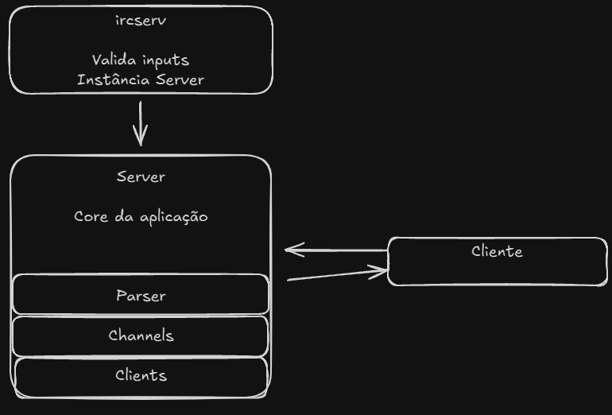

# Apresentando um Servidor IRC
IRC (Internet Relay Chat) é um protocolo de comunicação em tempo real que permite múltiplos usuários se conectarem a um servidor central para trocar mensagens em canais (salas) ou conversas privadas.

# Arquitetura básica do projeto
O fluxo básico da implementação do servidor começa em ircserv, ele será o ponto de entrada de toda a aplicação, encapsulando as validações iniciais de inputs, signal handler, e tendo uma instância do Server, que é a classe responsável pela implementação de todo o core do servidor, como o polling não bloqueante, sockets, bind da porta e etc.

A classe Server é o núcleo da aplicação, e seu ciclo de vida permanecerá ativo por toda a execução do programa, guardando os estados dos clientes e gerenciando o I/O.

Cada Server guarda um vector com cada cliente sendo representado pela classe "Client", e cada instância de client tem a responsabilidade basicamente de guardar as informações do cliente, sendo quase toda composta com setters e getters, servindo quase como um mini banco de dados em runtime.

Toda mensagem recebida de um client chega no server, e logo depois é passada para a classe "Parser", essa classe tem o único objetivo de implementar os métodos para tratar cada tipo de comando, como o PASS, NICK, USER e etc.

E por último, temos a classe "Channel", que representa um canal dentro do nosso server, guardando as informações de operators e de clientes que estão no canal para fazermos o broadcast de cada mensagem enviada no canal para os demais clientes conectados.

# Configuração inicial do server
A configuração do servidor começa no método `ServerConfig()`, onde é criado o socket principal usando `socket(AF_INET, SOCK_STREAM, 0)`. Este socket é configurado para aceitar conexões TCP na família de endereços IPv4.

O endereço do servidor é definido através da estrutura `sockaddr_in`, configurando a família de endereços como `AF_INET`, a porta através de `htons()` para conversão de byte order, e o endereço IP como `INADDR_ANY` para aceitar conexões de qualquer interface de rede.

Após a criação do socket, são aplicadas configurações importantes através de `SetupSocketOptions()`: `SO_REUSEADDR` para permitir reutilização do endereço e `O_NONBLOCK` para tornar o socket não bloqueante, essencial para o funcionamento do polling.

O socket é então vinculado à porta especificada através de `bind()` e colocado em modo de escuta com `listen()`, configurado para aceitar até `SOMAXCONN` conexões simultâneas.

O sistema de polling é implementado usando a função `poll()` do sistema operacional. O servidor mantém um vector de estruturas `pollfd` que monitora todos os file descriptors ativos - tanto o socket principal quanto os sockets dos clientes conectados. Cada estrutura `pollfd` é configurada para monitorar eventos de entrada (`POLLIN`) e saída (`POLLOUT`).

O loop principal em `WaitConnection()` fica aguardando eventos através de `poll()` com timeout infinito. Quando eventos são detectados, `HandlePollEvents()` processa cada file descriptor que tem eventos pendentes: novos clientes são aceitos no socket principal, dados são recebidos dos clientes existentes, e mensagens são enviadas quando o socket está pronto para escrita.

# O que é I/O não bloqueante?
I/O não bloqueante é um conceito fundamental em programação de sistemas que permite que um programa continue executando outras tarefas enquanto aguarda operações de entrada e saída (como leitura de dados de um socket ou escrita em um arquivo).

Em um sistema bloqueante tradicional, quando o programa tenta ler dados de um socket, ele "trava" e fica esperando até que os dados cheguem. Isso significa que o programa não pode fazer mais nada durante esse tempo - ele está literalmente bloqueado.

No nosso servidor IRC, isso seria um problema sério. Imagine que temos 100 clientes conectados e um deles está enviando uma mensagem muito longa. Em um sistema bloqueante, o servidor ficaria parado esperando essa mensagem terminar, ignorando completamente os outros 99 clientes que podem estar tentando se conectar ou enviar mensagens.

Em resumo, I/O não bloqueante transforma nosso servidor de um sistema que atende um cliente por vez em um sistema que pode gerenciar centenas de clientes simultaneamente.