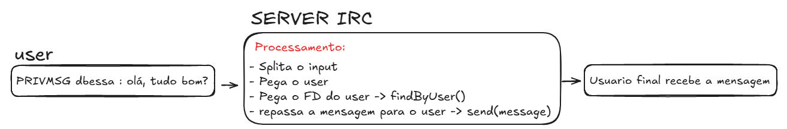

O comando PRIVMSG serve para mandar uma mensagem privada para um usuario no server IRC.

Esse comando funciona da seguinte maneira:
``` sh
PRIVMSG <NICKNAME> :MESSAGE
```

Recebe o nickname do usuario como parametro, e depois a mensagem.

a mensagem é considerado tudo após o ":"

## Processamento
